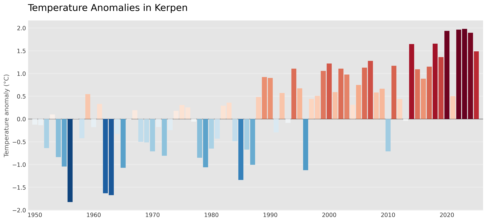

# Annual Temperature Anomalies

A Python tutorial for calculating and visualizing annual temperature anomalies
from monthly mean temperature data.

The workflow:

- loads monthly temperature data from CSV,
- aggregates monthly values to annual means,
- calculates anomalies relative to a user-defined reference period,
- saves the calculated results as CSV,
- visualizes annual anomalies using Matplotlib,
- saves the resulting figure.

## Input data

The input CSV must contain:

- a date column in `YYYY-MM-DD` format,
- a numeric column containing monthly mean temperature,
- a column containing the unit.

The column names are specified explicitly when calling the workflow, so the
column order does not matter.

For example:

| date | air_temperature_mean_celsius | unit |
|---|---:|---|
| 1881-01-01 | -2.69 | °C |
| 1881-02-01 | 3.19 | °C |

## Method

Monthly mean temperature values are first aggregated to annual means.

The annual anomaly is then calculated as:

annual anomaly = annual mean - reference-period mean

The reference period can be specified by the user.

## Assumptions

This tutorial assumes that the monthly input time series has already been checked for missing observations.

The current workflow is designed for monthly mean temperature data and uses the arithmetic mean to calculate annual values.

## Results

